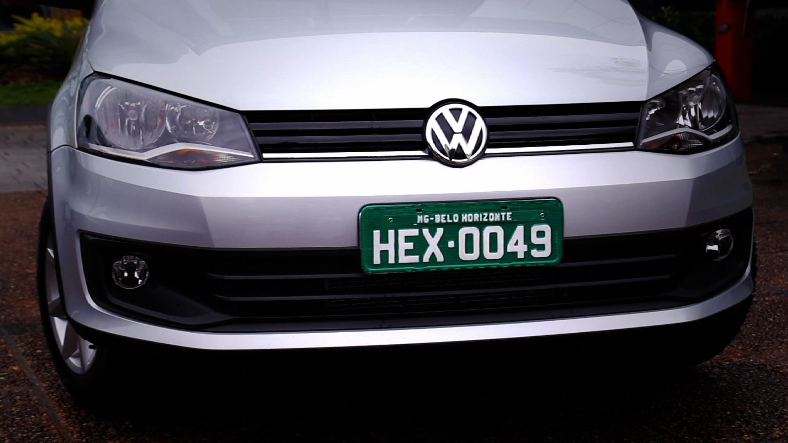
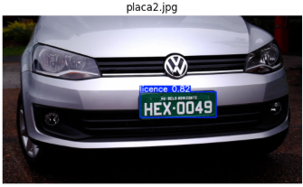
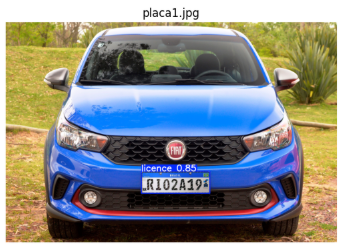
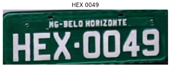
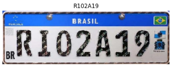

# Sistema de Deteccion y Reconocimiento de Placas Vehiculares con YOLOv8 y EasyOCR

## Descripción

Este proyecto implementa un sistema de visión por computadora capaz de detectar placas vehiculares y extraer automáticamente el número de matrícula a partir de imágenes.

Para ello se desarrolló una tubería completa que incluye preprocesamiento de imágenes, preparación del dataset, entrenamiento de un modelo YOLOv8 para detección de placas y reconocimiento óptico de caracteres (OCR) mediante EasyOCR.

El sistema fue desarrollado en Google Colab utilizando Python y librerías especializadas de inteligencia artificial y procesamiento digital de imágenes.

## Objetivos
- Detectar automáticamente placas vehiculares en imágenes.
- Localizar con precisión la región de interés utilizando YOLOv8.
- Extraer el texto de la matrícula mediante OCR.
- Mejorar la calidad de las imágenes para aumentar la precisión del reconocimiento.
## Tecnologías utilizadas
- Python
- YOLOv8
- OpenCV
- EasyOCR
- NumPy
- Scikit-Learn
- Matplotlib
- Google Colab
# Flujo de trabajo
## 1. Obtención del dataset

- Se utilizó el dataset de detección de placas vehiculares disponible en Kaggle.

## 2. Preprocesamiento
Se aplicaron técnicas de mejora de imagen:

- Conversión de color RGB.
- Reducción de ruido mediante Gaussian Blur.
- Ecualización adaptativa utilizando CLAHE.
- Normalización de intensidad.
  
## 3. Preparación de datos
- División automática del dataset en entrenamiento y validación.
Conversión de anotaciones XML (Pascal VOC) al formato YOLO.
Generación automática del archivo data.yaml.
## 4. Entrenamiento

Se entrenó un modelo YOLOv8 utilizando:

- Resolución de entrada: 640 × 640
- 50 épocas de entrenamiento
- Dataset personalizado de placas vehiculares
## 5. Detección

- El modelo entrenado identifica automáticamente las placas presentes en una imagen y genera las coordenadas de cada detección.

## 6. Extracción de la placa

- Las regiones detectadas son recortadas automáticamente para ser procesadas por el módulo OCR.

## 7. Reconocimiento de caracteres

- Se empleó EasyOCR para reconocer el texto contenido en la matrícula.

Antes del OCR se aplicaron:

- Escalado de imagen.
- Conversión a escala de grises.
- Filtro bilateral.
- CLAHE para mejora de contraste.
## 8. Resultado final

El sistema muestra:

- Imagen con la placa detectada.
- Región recortada de la matrícula.
- Texto reconocido automáticamente.

# Ejemplos
## Detección de placas

  
  
  

  
  
  

## OCR

## Demostración

  

# Autor

## Ricardo Guzman

Estudiante de Ingeniería en Computación

Proyecto académico enfocado en Visión por Computadora e Inteligencia Artificial.
